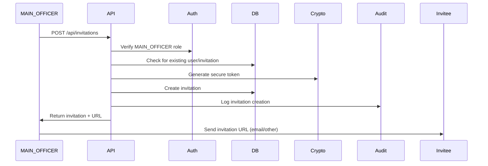
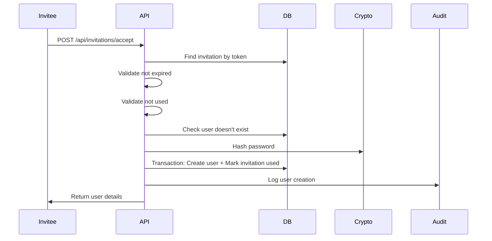

# Invitation System Documentation

## Overview

SecYourFlow implements a banking-grade, invite-only user provisioning system. Public self-registration is **disabled in production** to ensure strict access control and multi-tenant isolation.

## Security Architecture

### Key Security Features

1. **Invite-Only Access**: Users can only be added by MAIN_OFFICER via secure invitations
2. **Cryptographic Tokens**: 32-byte (256-bit) entropy tokens using `crypto.randomBytes`
3. **Time-Limited Invitations**: Default 48-hour expiration (configurable 1-168 hours)
4. **Single-Use Tokens**: Invitations are marked as used and cannot be reused
5. **Organization Binding**: Users are bound to the inviting organization
6. **Role-Based Access**: Only MAIN_OFFICER can create/manage invitations
7. **Audit Logging**: All invitation operations are logged with organizationId
8. **Production Lockdown**: Public registration is hardcoded to fail in production

## API Endpoints

### Create Invitation

**Endpoint**: `POST /api/invitations`

**Authentication**: Required (MAIN_OFFICER only)

**Request Body**:
```json
{
  "email": "user@example.com",
  "role": "ANALYST",
  "expiresInHours": 48
}
```

**Response** (201):
```json
{
  "message": "Invitation created successfully",
  "invitation": {
    "id": "clx...",
    "email": "user@example.com",
    "role": "ANALYST",
    "token": "abc123...",
    "expiresAt": "2026-02-19T12:00:00.000Z",
    "createdAt": "2026-02-17T12:00:00.000Z",
    "inviteUrl": "https://app.example.com/auth/accept-invite?token=abc123..."
  }
}
```

**Errors**:
- `401`: Unauthorized (not logged in)
- `403`: Forbidden (not MAIN_OFFICER)
- `409`: Conflict (user or active invitation already exists)

### List Invitations

**Endpoint**: `GET /api/invitations`

**Authentication**: Required (MAIN_OFFICER only)

**Response** (200):
```json
{
  "invitations": [
    {
      "id": "clx...",
      "email": "user@example.com",
      "role": "ANALYST",
      "expiresAt": "2026-02-19T12:00:00.000Z",
      "usedAt": null,
      "createdAt": "2026-02-17T12:00:00.000Z",
      "createdBy": {
        "id": "clx...",
        "name": "Admin User",
        "email": "admin@example.com"
      }
    }
  ]
}
```

### Revoke Invitation

**Endpoint**: `DELETE /api/invitations/:id`

**Authentication**: Required (MAIN_OFFICER only)

**Response** (200):
```json
{
  "message": "Invitation revoked successfully"
}
```

**Errors**:
- `400`: Bad Request (invitation already used)
- `403`: Forbidden (invitation belongs to another organization)
- `404`: Not Found (invitation doesn't exist)

### Accept Invitation

**Endpoint**: `POST /api/invitations/accept`

**Authentication**: Not required (public endpoint)

**Request Body**:
```json
{
  "token": "abc123...",
  "name": "John Doe",
  "password": "SecurePassword123!"
}
```

**Response** (201):
```json
{
  "message": "Account created successfully",
  "user": {
    "id": "clx...",
    "name": "John Doe",
    "email": "user@example.com",
    "role": "ANALYST",
    "organizationId": "clx..."
  }
}
```

**Errors**:
- `400`: Bad Request (invalid token format or validation error)
- `404`: Not Found (invalid token)
- `409`: Conflict (user already exists)
- `410`: Gone (invitation expired or already used)

## Database Schema

```prisma
model Invitation {
  id             String    @id @default(cuid())
  email          String
  organizationId String
  role           Role      @default(ANALYST)
  token          String    @unique
  expiresAt      DateTime
  usedAt         DateTime?
  createdById    String
  createdAt      DateTime  @default(now())
  updatedAt      DateTime  @updatedAt
  
  createdBy      User         @relation("InvitationCreatedBy", fields: [createdById], references: [id], onDelete: Cascade)
  organization   Organization @relation(fields: [organizationId], references: [id], onDelete: Cascade)

  @@index([email])
  @@index([token])
  @@index([organizationId])
  @@index([expiresAt])
  @@index([organizationId, email])
}
```

## Workflow

### 1. MAIN_OFFICER Creates Invitation



### 2. Invitee Accepts Invitation



## Security Considerations

### Token Security

- **Entropy**: 32 bytes (256 bits) = 2^256 possible tokens
- **Format**: Base64url (URL-safe, no padding)
- **Length**: Minimum 43 characters
- **Uniqueness**: Database unique constraint
- **Timing Attacks**: Not applicable (tokens are not compared in constant time as they're looked up by unique index)

### Expiration

- **Default**: 48 hours
- **Range**: 1-168 hours (1 week maximum)
- **Enforcement**: Server-side validation on acceptance
- **Cleanup**: Expired invitations can be manually deleted (no auto-cleanup to preserve audit trail)

### Multi-Tenant Isolation

- All invitation queries include `organizationId` filter
- Cross-organization access is prevented at API level
- Users are bound to invitation's organization
- MAIN_OFFICER can only manage invitations for their organization

### RBAC Enforcement

- **Create**: MAIN_OFFICER only
- **List**: MAIN_OFFICER only
- **Revoke**: MAIN_OFFICER only
- **Accept**: Public (no authentication required)

### Audit Trail

All operations are logged with:
- Action type
- User ID (for authenticated operations)
- Organization ID
- Email address
- Timestamp
- IP address (where available)

## Production Deployment

### Environment Variables

```bash
# CRITICAL: Public registration is ALWAYS disabled in production
NODE_ENV=production

# This setting is IGNORED in production (registration always disabled)
ALLOW_PUBLIC_REGISTRATION=false
```

### Pre-Deployment Checklist

Run security verification:
```bash
npm run security:verify-invitations
```

All checks must pass:
- ✅ No REGISTRATION_DEFAULT_ORGANIZATION_ID in code
- ✅ Production registration blocked
- ✅ Invitation model exists
- ✅ Invitation token is unique
- ✅ Invitation API requires MAIN_OFFICER
- ✅ Invitation acceptance is public
- ✅ Token generation uses crypto.randomBytes
- ✅ Invitation expiry validation
- ✅ Invitation usage validation
- ✅ Audit logging for invitations
- ✅ Organization scoping in queries
- ✅ Transaction for user creation

### Migration

```bash
# Apply database migration
npx prisma migrate deploy

# Verify migration
npx prisma migrate status
```

## Testing

### Unit Tests

```bash
npm test
```

### Integration Tests

See `src/__tests__/integration/invitation-flow.integration.test.md` for manual testing checklist.

### Security Tests

```bash
npm run security:verify-invitations
```

## Troubleshooting

### "Registration is disabled" Error

**Cause**: Public registration is blocked in production.

**Solution**: Use invitation system. MAIN_OFFICER must create invitation.

### "Invitation has expired" Error

**Cause**: Invitation token is older than expiration time.

**Solution**: MAIN_OFFICER must create new invitation.

### "Invitation has already been used" Error

**Cause**: Token was already used to create an account.

**Solution**: MAIN_OFFICER must create new invitation if needed.

### "Forbidden: insufficient role permissions" Error

**Cause**: Non-MAIN_OFFICER user trying to create/manage invitations.

**Solution**: Only MAIN_OFFICER can manage invitations.

## Migration from Old System

If you have existing users created with `REGISTRATION_DEFAULT_ORGANIZATION_ID`:

1. **No action required** - existing users continue to work
2. **New users** - must be invited via invitation system
3. **Environment cleanup** - remove `REGISTRATION_DEFAULT_ORGANIZATION_ID` from `.env`

## Best Practices

1. **Invitation Expiry**: Use shorter expiration times (24-48 hours) for sensitive roles
2. **Email Delivery**: Send invitation URLs via secure email with clear instructions
3. **Revocation**: Revoke unused invitations if employee doesn't join
4. **Audit Review**: Regularly review invitation audit logs
5. **Role Assignment**: Assign minimum required role (principle of least privilege)
6. **Token Handling**: Never log or expose invitation tokens in error messages

## Compliance

This invitation system meets banking-grade security requirements:

- ✅ **Access Control**: Invite-only, no public registration
- ✅ **Cryptographic Security**: 256-bit entropy tokens
- ✅ **Audit Trail**: Complete logging of all operations
- ✅ **Multi-Tenant Isolation**: Strict organization boundaries
- ✅ **Role-Based Access**: MAIN_OFFICER-only management
- ✅ **Time-Limited Access**: Expiring invitations
- ✅ **Single-Use Tokens**: Prevents replay attacks
- ✅ **Production Hardening**: Hardcoded production restrictions
